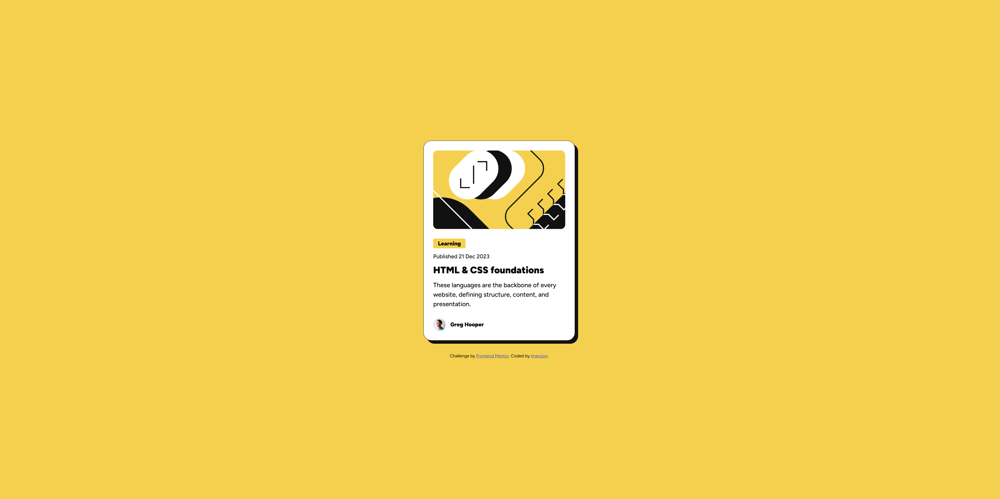

# Frontend Mentor - Blog preview card solution

This is my solution to the [Blog preview card challenge on Frontend Mentor](https://www.frontendmentor.io/challenges/blog-preview-card-ckPaj01IcS).

## Overview

### The challenge

The challenge was to build a responsive blog preview card and make it look as close to the provided design as possible.

Users should be able to:

- View the page on different screen sizes
- See a responsive blog preview card
- See hover and focus states for interactive elements

### Screenshot



### Links

- Solution URL: [GitHub repository](YOUR_GITHUB_REPO_URL)
- Live Site URL: [View the live site](YOUR_LIVE_SITE_URL)

## My process

### Built with

- HTML5
- CSS
- Flexbox
- Responsive design
- Google Fonts
- Figtree

### What I learned

This project helped me practise building a responsive card layout from a design reference.

One thing I particularly learned was how to control an image's dimensions while maintaining its appearance using `object-fit: cover`.

```css
.card-hero img {
  width: 100%;
  height: 200px;
  object-fit: cover;
}
```

I also got more comfortable using CSS Flexbox for layout and spacing, as well as using media queries to adjust the design for smaller screens.

### Continued development

I want to continue improving my understanding of responsive layouts and become more confident translating designs from Figma into clean, maintainable HTML and CSS.

### Author

- Frontend Mentor - [@YOUR_USERNAME](https://www.frontendmentor.io/)
- GitHub - [@YOUR_USERNAME](https://github.com/)
